# Write-up: GitHub Security Lab CTF: Go and don't return

## Final query:
> File: [doesNotReturnOnError.ql](doesNotReturnOnError.ql)

### Results for the custom database:
21 results as expected:
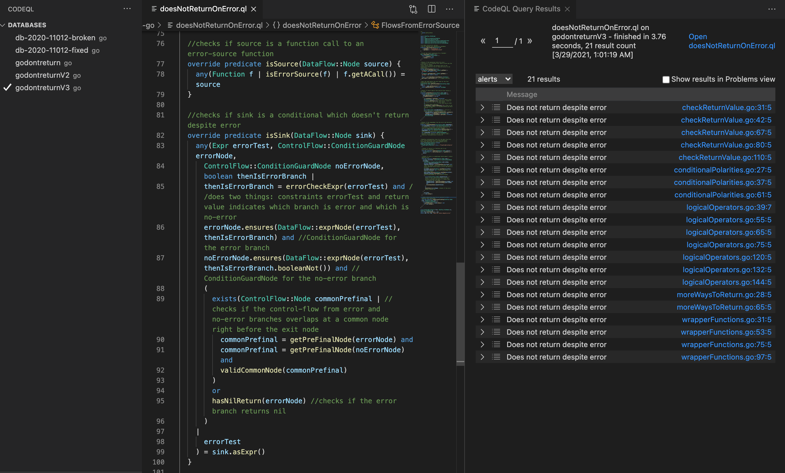


### Results for unpatched minio database:
1 true-positive issue as expected:
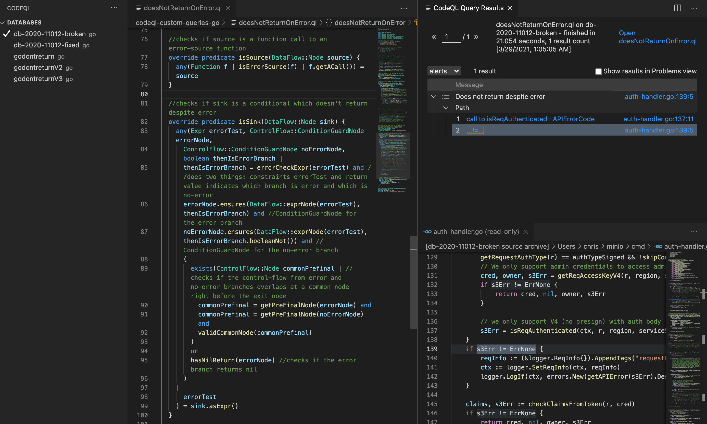

### Results for fixed minio database:
We do get 1 result from `admin-handlers.go` which based on our criteria and heuristics is a valid result (but may be discarded because of the call to `writeErrorResponseJSON` before the `return nil`?). I chose to keep it to keep the query generic enough:
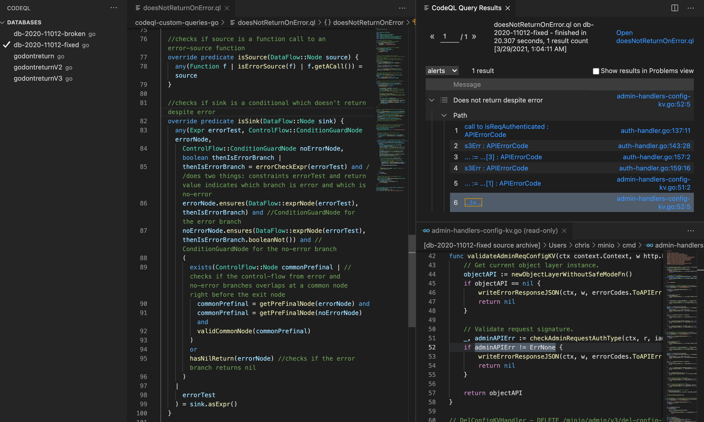

## Steps
## Step 1
### Step 1.1
> File: [step-1.1.ql](step-1.1.ql)
```
from Ident i
where i.getName() = "ErrNone"
select i
```
231 results:
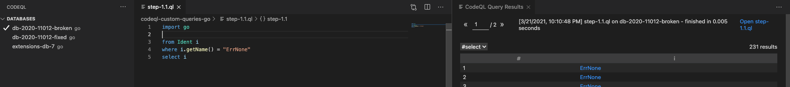

### Step 1.2
> File: [step-1.2.ql](step-1.2.ql)
```
from Ident i, Expr e
where i.getName() = "ErrNone" and e.(EqualityTestExpr).getAnOperand() = i
select e
```
158 results:
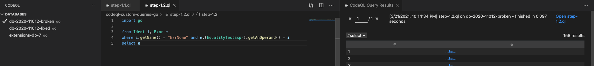

### Step 1.3
> File: [step-1.3.ql](step-1.3.ql)
```
from Ident i, Expr e, IfStmt s
where i.getName() = "ErrNone" and e.(EqualityTestExpr).getAnOperand() = i and s.getCond() = e
select s
```
133 results:
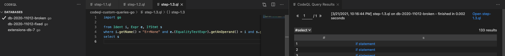

### Step 1.4
> File: [step-1.4.ql](step-1.4.ql)
```
from ReturnStmt r
select r
```
10,651 results:
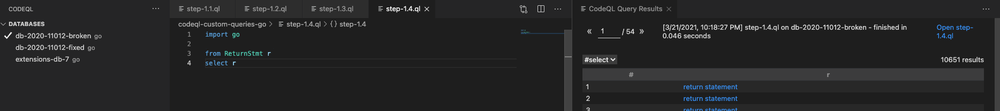

### Step 1.5
> File: [step-1.5.ql](step-1.5.ql)
```
from IfStmt i
where not i.getThen().getAChildStmt() instanceof ReturnStmt
select i
```
3541 results:
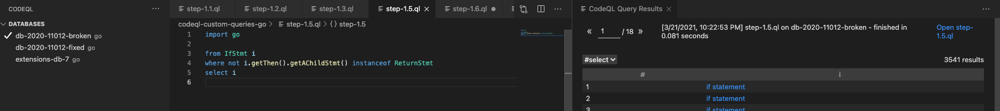

### Step 1.6
> File: [step-1.5.ql](step-1.6.ql)
```
from Ident i, Expr e, IfStmt s
where i.getName() = "ErrNone" and e.(EqualityTestExpr).getAnOperand() = i and s.getCond() = e
    and not exists(ReturnStmt r | r=s.getThen().getAChildStmt())
select s
```
7 results:
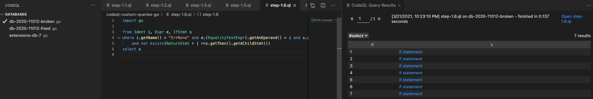


## Step 2
### Step 2.1
> File: [step-2.1.ql](step-2.1.ql)
```
/**
 * @kind path-problem
 */
import DataFlow::PathGraph

import go
import semmle.go.dataflow.DataFlow

class FlowsFromIsReqAuth extends DataFlow::Configuration {
  FlowsFromIsReqAuth() { this = "FlowsFromIsReqAuth" }

  override predicate isSource(DataFlow::Node source) {
    any(Function f | f.getName() = "isReqAuthenticated" | f.getACall()) = source
  }

  override predicate isSink(DataFlow::Node sink) {
    any(EqualityTestExpr e | | e.getAnOperand()) = sink.asExpr()
  }
}

from FlowsFromIsReqAuth flow, DataFlow::PathNode src, DataFlow::PathNode snk
where flow.hasFlowPath(src, snk)
select snk,src,snk,"Interesting conditionals"
```
64 results:
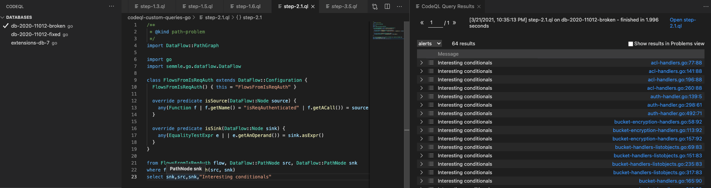

### Step 2.2
> File: [step-2.2.ql](step-2.2.ql)

Changes in `isSink`:
```
override predicate isSink(DataFlow::Node sink) {
    any(EqualityTestExpr e, IfStmt i |
      e.getAnOperand().(Ident).getName() = "ErrNone" and
      not exists(ReturnStmt r | r = i.getThen().getAChildStmt()) and
      i.getCond() = e
    |
      e.getAnOperand()
    ) = sink.asExpr()
  }
```
1 True bug:
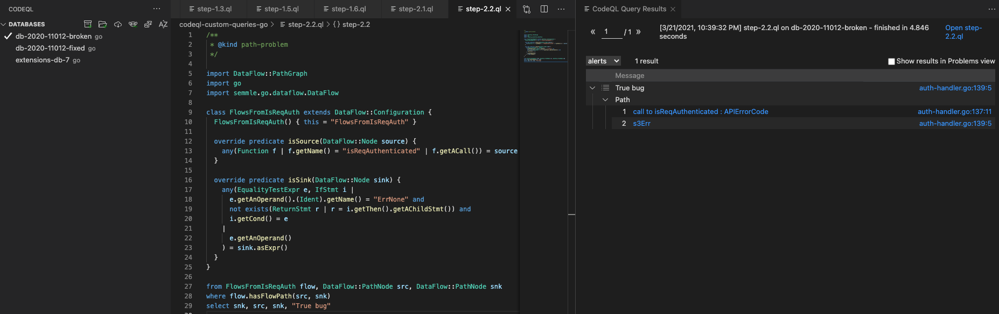

## Step 2.3
0 results on fixed version:
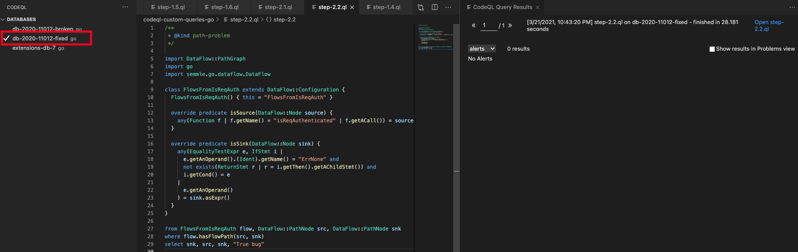

## Step 3
### Step 3.1
> File: [step-3.1.ql](step-3.1.ql)

Changes in `isSink`
```
override predicate isSink(DataFlow::Node sink) {
    any(EqualityTestExpr e, IfStmt i, Ident errnone |
      i.getCond() = e and
      e.getAnOperand() = errnone and
      errnone.getName() = "ErrNone" and
      (
        e.getPolarity() = false and
        not exists(ReturnStmt r | r = i.getThen().getAChildStmt())
        or
        e.getPolarity() = true and
        not exists(ReturnStmt r | r = i.getElse().getAChildStmt())
      )
    |
      e.getAnOperand()
    ) = sink.asExpr()
  }
```
3 results from conditionalPolarities.go:
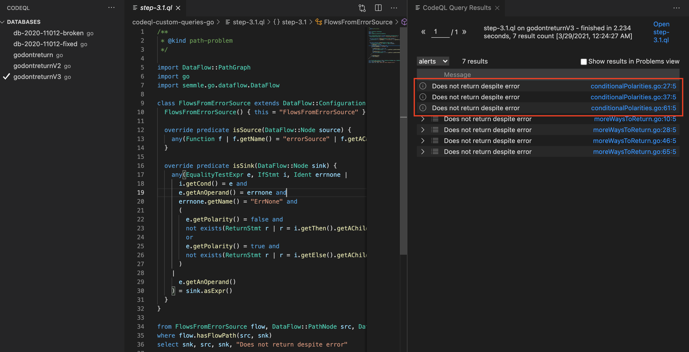

### Step 3.2
> File: [step-3.2.ql](step-3.2.ql)

Some helper functions added:
```
boolean errorCheckExpr(Expr e) {
  e.(NeqExpr).getAnOperand().(Ident).getName() = "ErrNone" and result = true
  or
  e.(EqExpr).getAnOperand().(Ident).getName() = "ErrNone" and result = false
}

ControlFlow::Node getPreFinalNode(ControlFlow::Node node){
  result = node.getASuccessor+() and
  result.getASuccessor() instanceof ExitNode
}
```
Changes in `isSink`
```
  override predicate isSink(DataFlow::Node sink) {
    any(EqualityTestExpr errorTest,
      ControlFlow::ConditionGuardNode errorNode,
      ControlFlow::ConditionGuardNode noErrorNode, boolean thenIsErrorBranch |
      thenIsErrorBranch = errorCheckExpr(errorTest) and
      errorNode.ensures(DataFlow::exprNode(errorTest),thenIsErrorBranch) and
      noErrorNode.ensures(DataFlow::exprNode(errorTest), thenIsErrorBranch.booleanNot()) and
      exists(ControlFlow::Node commonPrefinal | commonPrefinal=getPreFinalNode(errorNode) and commonPrefinal=getPreFinalNode(noErrorNode)) 
    |
      errorTest.getAnOperand()
    ) = sink.asExpr()
  }
}
```
2 results from moreWaysToReturn.go:
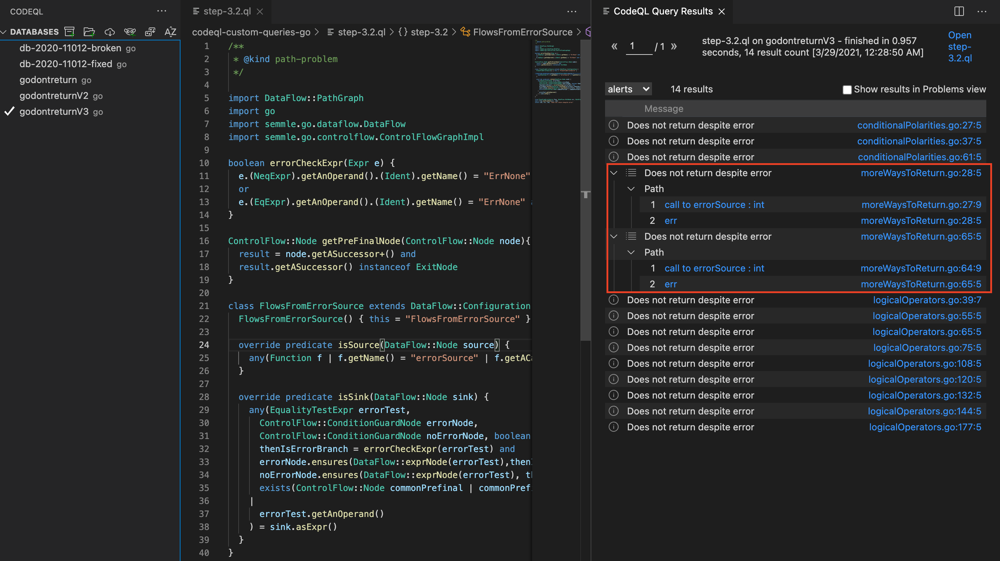

### Step 3.3
> File: [step-3.3.ql](step-3.3.ql)

Helper function added:
```
Expr resultExpr(FuncDecl f) {
  exists(DataFlow::ResultNode r |
    f = r.getRoot() and
    r.asExpr() = result
  )
}
```


Changes in `errorCheckExpr`:
```
boolean errorCheckExpr(Expr e) {
  e.(NeqExpr).getAnOperand().(Ident).getName() = "ErrNone" and result = true
  or
  e.(EqExpr).getAnOperand().(Ident).getName() = "ErrNone" and result = false
  or
  result = errorCheckExpr(resultExpr(e.(CallExpr).getTarget().getFuncDecl()))
}
```

Changes in `isSink`:
```
  override predicate isSink(DataFlow::Node sink) {
    any(Expr errorTest, ControlFlow::ConditionGuardNode errorNode,
      ControlFlow::ConditionGuardNode noErrorNode, boolean thenIsErrorBranch |
      thenIsErrorBranch = errorCheckExpr(errorTest) and
      errorNode.ensures(DataFlow::exprNode(errorTest), thenIsErrorBranch) and
      noErrorNode.ensures(DataFlow::exprNode(errorTest), thenIsErrorBranch.booleanNot()) and
      exists(ControlFlow::Node commonPrefinal |
        commonPrefinal = getPreFinalNode(errorNode) and
        commonPrefinal = getPreFinalNode(noErrorNode)
      )
    |
      errorTest
    ) = sink.asExpr()
  }
```
and a new `isAdditionalFlowStep` predicate added to the DataFlow configuration to account for DataFlow from a an operand to its equality test expression:
```
override predicate isAdditionalFlowStep(DataFlow::Node pred, DataFlow::Node succ) {
    exists(EqualityTestExpr e |
      e.getAnOperand() = pred.asExpr() and
      e = succ.asExpr()
    )
  }
```
4 results from wrapperFunctions.go:
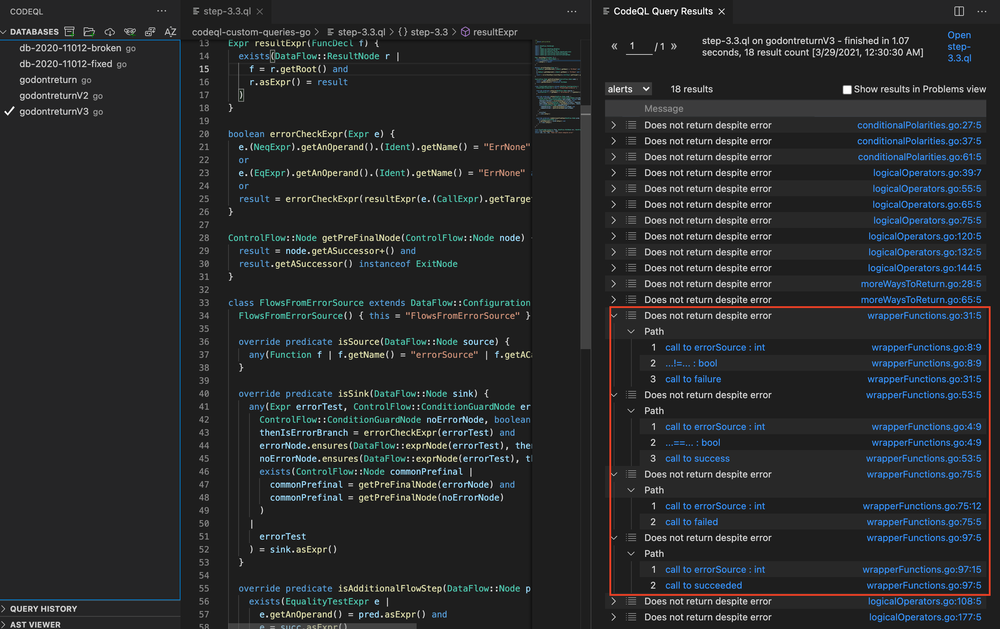

### Step 3.4
> File: [step-3.4.ql](step-3.4.ql)

Change in `isSink`:
```
  override predicate isSink(DataFlow::Node sink) {
    any(Expr errorTest, ControlFlow::ConditionGuardNode errorNode,
      ControlFlow::ConditionGuardNode noErrorNode, boolean thenIsErrorBranch |
      thenIsErrorBranch = errorCheckExpr(errorTest) and
      errorNode.ensures(DataFlow::exprNode(errorTest), thenIsErrorBranch) and
      noErrorNode.ensures(DataFlow::exprNode(errorTest), thenIsErrorBranch.booleanNot()) and
      exists(ControlFlow::Node commonPrefinal |
        commonPrefinal = getPreFinalNode(errorNode) and
        commonPrefinal = getPreFinalNode(noErrorNode) and
        not(commonPrefinal instanceof IR::ReturnInstruction)
      )
    |
      errorTest
    ) = sink.asExpr()
  }
```

7 results from logicalOperators.go:
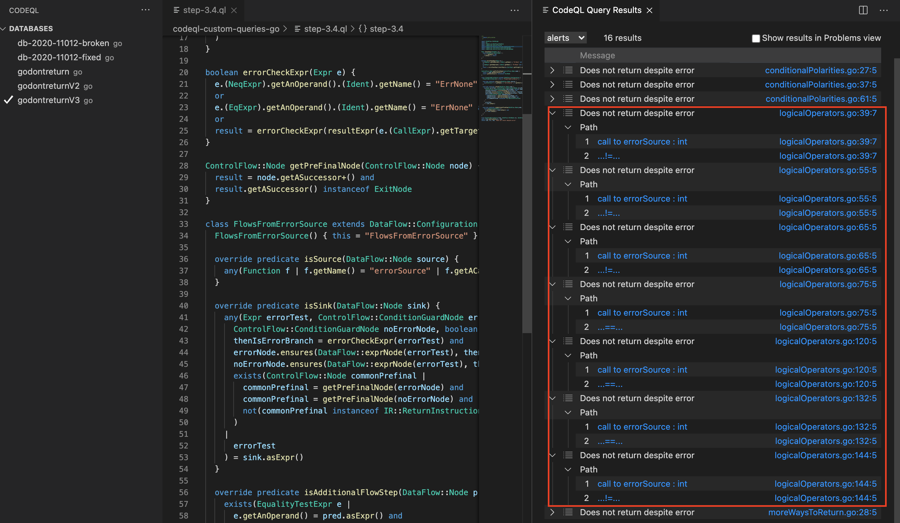


### Step 3.5
> File: [step-3.5.ql](step-3.5.ql)

Helper functiona added:
```
predicate hasNilReturn(ControlFlow::Node node) {
  exists(IR::ReturnInstruction ri, ReturnStmt rs |
    node.getASuccessor+() = ri and
    ri.getReturnStmt() = rs and
    (
      rs.getAnExpr().getType() instanceof NilLiteralType
      or
      exists(ReturnStmt nestedNilReturn |
        nestedNilReturn.getEnclosingFunction().getACall().asExpr() = rs.getAnExpr().(CallExpr) and
        nestedNilReturn.getAnExpr().getType() instanceof NilLiteralType
      )
    )
  )
}
```
Changes in `isSink`:
```
  override predicate isSink(DataFlow::Node sink) {
    any(Expr errorTest, ControlFlow::ConditionGuardNode errorNode,
      ControlFlow::ConditionGuardNode noErrorNode, boolean thenIsErrorBranch |
      thenIsErrorBranch = errorCheckExpr(errorTest) and
      errorNode.ensures(DataFlow::exprNode(errorTest), thenIsErrorBranch) and
      noErrorNode.ensures(DataFlow::exprNode(errorTest), thenIsErrorBranch.booleanNot()) and
      (
        exists(ControlFlow::Node commonPrefinal |
          commonPrefinal = getPreFinalNode(errorNode) and
          commonPrefinal = getPreFinalNode(noErrorNode) and
          not commonPrefinal instanceof IR::ReturnInstruction
        )
        or
        hasNilReturn(errorNode)
      )
    |
      errorTest
    ) = sink.asExpr()
  }
```

5 results from checkReturnValue.go:
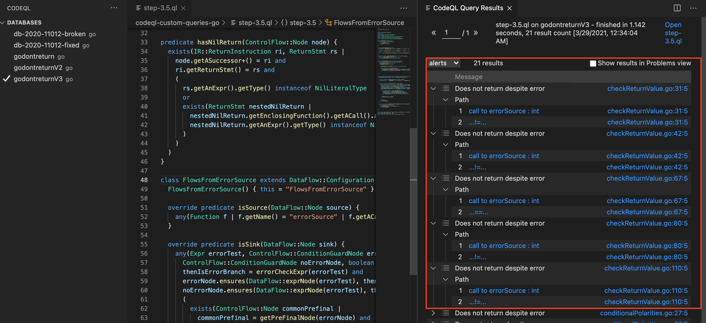

## Final query (for both databases):
> File: [doesNotReturnOnError.ql](doesNotReturnOnError.ql)

Added a helper function to remove multiple false-positives from the minio db:
```
//Checks if the commonNode from the error and non-error branch is valid
predicate validCommonNode(ControlFlow::Node commonNode){
  not(commonNode instanceof IR::ReturnInstruction) and //it shouldn't be a return instruction otherwise two cases in logicalOperators.go get flagged
  not exists(DeferStmt d|MkExprNode(d.getAChildExpr()) = commonNode) and //it shouldn't be a defered node - otherwise false-positives in minio db
  not (commonNode instanceof MkResultReadNode) //shouldn't be an implicit read (of results) node - otherwise false-positives in minio db
}
```

Modified nil return based on heuristics to prevent another false-positive in minio db. 
Heuristic used: nil along with other values should be considered fine (unless the only other value is an empty string)
```
predicate hasNilReturn(ControlFlow::Node node) {
  exists(IR::ReturnInstruction ri, ReturnStmt rs |
    node.getASuccessor+() = ri and
    ri.getReturnStmt() = rs and
    (
      (rs.getAnExpr().getType() instanceof NilLiteralType and //checks for nil return value
      (count(rs.getAnExpr())=1 //Heuristics: checks if it returns nil and is the only return
      or                       //(as there may be other variables being returned)
      rs.getAnExpr().getStringValue()="")) //This is for func multiReturnBad() in checkReturnValue.go which returns "", nil.
      or
      exists(ReturnStmt nestedNilReturn | //If nil is being returned in a wrapped/nested way
        nestedNilReturn.getEnclosingFunction().getACall().asExpr() = rs.getAnExpr().(CallExpr) and
        nestedNilReturn.getAnExpr().getType() instanceof NilLiteralType
      )
    )
  )
}
```

Updated `isSink`:
```
  //checks if sink is a conditional which doesn't return despite error
  override predicate isSink(DataFlow::Node sink) {
    any(Expr errorTest, ControlFlow::ConditionGuardNode errorNode,
      ControlFlow::ConditionGuardNode noErrorNode, boolean thenIsErrorBranch |
      thenIsErrorBranch = errorCheckExpr(errorTest) and //does two things: constraints errorTest and return value indicates which branch is error and which is no-error
      errorNode.ensures(DataFlow::exprNode(errorTest), thenIsErrorBranch) and //ConditionGuardNode for the error branch
      noErrorNode.ensures(DataFlow::exprNode(errorTest), thenIsErrorBranch.booleanNot()) and //ConditionGuardNode for the no-error branch
      (
        exists(ControlFlow::Node commonPrefinal | //checks if the control-flow from error and no-error branches overlaps at a common node right before the exit node
          commonPrefinal = getPreFinalNode(errorNode) and
          commonPrefinal = getPreFinalNode(noErrorNode) and
          validCommonNode(commonPrefinal)
        )
        or
        hasNilReturn(errorNode) //checks if the error branch returns nil
      )
    |
      errorTest
    ) = sink.asExpr()
  }
```